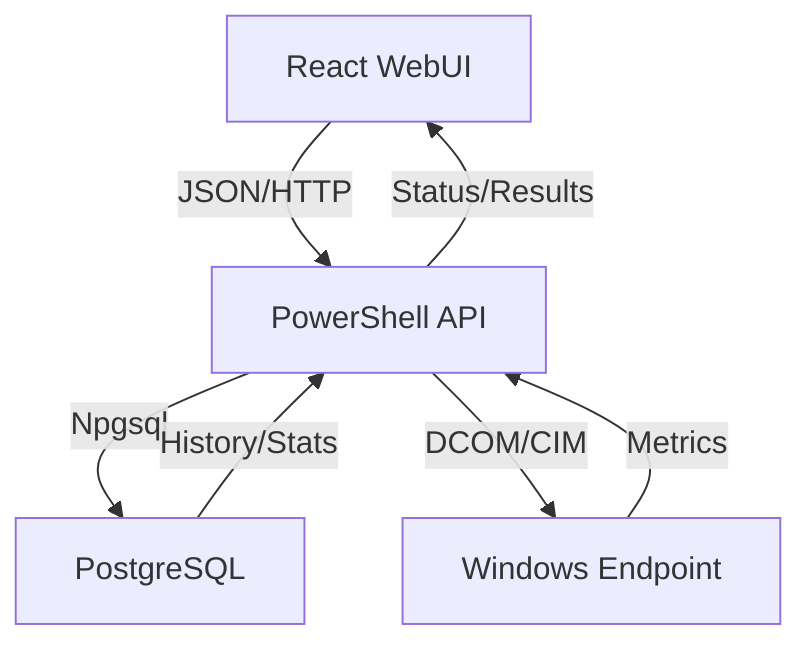

# EMS Low-Level Structure

## 1. Project Directory Tree
```text
EMS/
├── .gitignore                  # Git exclusion rules (Reduces repo size)
├── .git/                       # Local git repository
├── PowerShellEndPointv2/       # Main Application Root
│   ├── API/                    # Backend Logic
│   │   └── Start-EMSAPI.ps1    # Main REST API entry point
│   ├── Config/                 # Application Configuration
│   │   └── EMSConfig.json      # Main settings file
│   ├── Database/               # SQL Schemas & Migrations
│   │   ├── schema.sql          # Base schema
│   │   └── schema_granular_metrics_*.sql # Advanced metric tables
│   ├── Deployment/             # Deployment Guides
│   │   └── IIS_Setup.md        # Production hosting guide
│   ├── Modules/                # Core PowerShell Library
│   │   ├── Database/           # DB Connectivity (PSPGSql)
│   │   ├── Authentication.psm1 # User validation
│   │   ├── BulkProcessor.psm1  # Batch logic & Reporting
│   │   └── Scan/               # Specific scanning modules
│   ├── WebUI/                  # Frontend Logic
│   │   ├── public/             # Static assets
│   │   ├── src/                # React Source Code
│   │   │   ├── components/     # UI Building Blocks
│   │   │   └── services/       # API interaction layers
│   │   └── package.json        # Node.js dependencies
│   └── Setup-EMS.ps1           # Installation script
```

## 2. Component Interaction
1.  **UI Trigger**: The user clicks "Scan" in the React WebUI.
2.  **API Call**: `WebUI/src/services/api.js` sends a POST request to `http://localhost:5000/scan/single`.
3.  **API Routing**: `API/Start-EMSAPI.ps1` receives the request, validates the JWT/GUID token, and checks AD permissions.
4.  **Worker Spawn**: `Start-EMSScan` function spawns a new **PowerShell Runspace**.
5.  **Data Collection**: The Runspace uses `Modules/Database/PSPGSql.psm1` to connect to PostgreSQL and CIM sessions to collect data from the remote endpoint.
6.  **Persistence**: Results are written to the `scans` and `metric_*` tables.
7.  **Dashboard Refresh**: The React UI polls the `/api/dashboard/stats` endpoint to update charts and health scores.

## 3. Data Flow
`User Interface` <--> `REST API (PowerShell)` <--> `PostgreSQL Database`
                                |
                                +--> `Remote Windows Endpoint (Agentless)`

